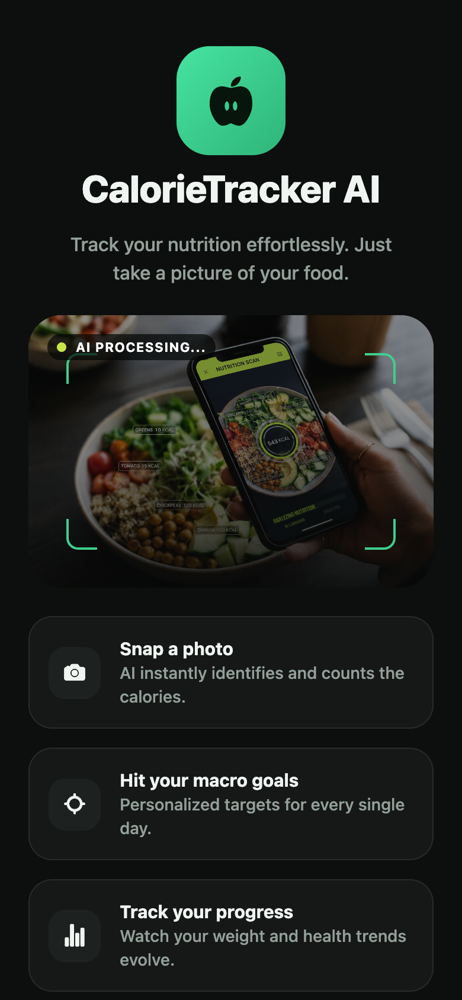
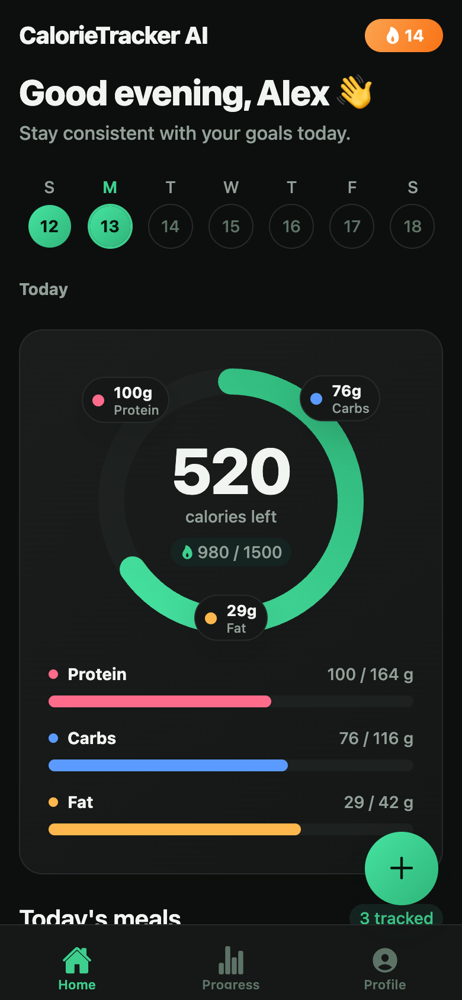
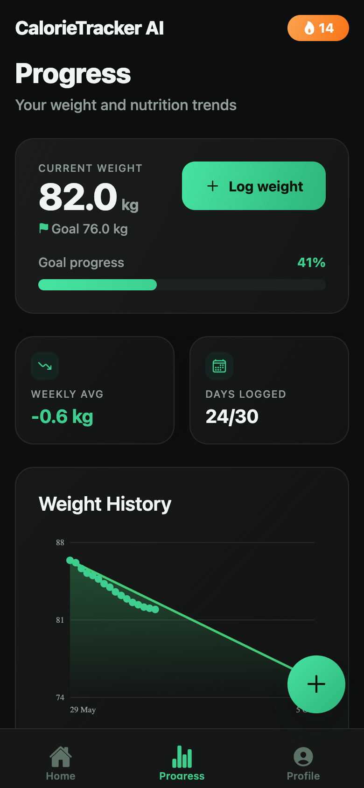
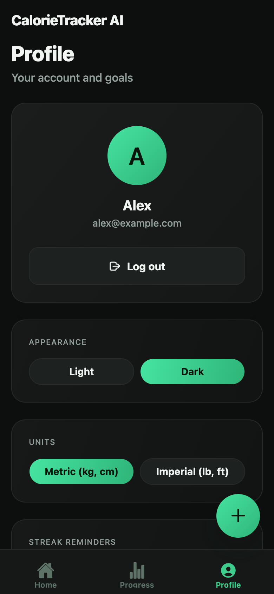

# CalorieTrackerAI 🍎

A personal AI-powered calorie & macro tracker I built as my own alternative to Cal AI.
I wanted the same experience without paying a yearly subscription, so I created an app that costs less than €1/month to run while still providing accurate AI-powered food analysis.
Beyond photo recognition, you can improve estimates by adding a meal description, scan barcodes for exact nutrition data, and follow an adaptive calorie and macro plan that evolves with your goals and progress.

Built with **Expo** + **React Native**.
Runs on **iOS, Android, and web** from a single codebase.

A **premium, dark-first UI** built around a focused emerald accent on flat
near-black surfaces — fluid spring animations, animated progress rings, and
delightful micro-interactions throughout.

## 📱 The interface

<p align="center">
  
  &nbsp;
  
  &nbsp;
  
  &nbsp;
  
</p>

<p align="center"><sub><b>Welcome</b> · <b>Home</b> dashboard with animated calorie ring &amp; floating nutrient chips · <b>Progress</b> weight trends &amp; adaptive plan · <b>Profile</b> settings</sub></p>

## Get started

```bash
npm install
npx expo start     # then press i (iOS), a (Android), or w (web)
```

Other scripts:

```bash
npm run ios        # open iOS simulator
npm run android    # open Android emulator
npm run web        # open in the browser
npm run lint       # expo lint
npx tsc --noEmit   # type-check
```

The app runs out of the box with **no configuration** — food estimation falls
back to an offline heuristic and data is stored locally. Add an Anthropic key
and a Supabase project (below) to unlock real AI estimates and cloud sync.

## What's in the box

- **Expo Router** file-based routing with a bottom tab bar (Home · Progress · Profile) plus modal screens for logging.
- **Onboarding wizard** that collects your stats and computes a personalized calorie/macro plan (Mifflin-St Jeor BMR × activity, adjusted toward a target weight/date).
- **AI food logging** — snap a photo and/or describe a meal and get a calorie + macro estimate from Claude's vision model, with an offline keyword heuristic as a no-key fallback.
- **Barcode scanning** — scan a packaged product's barcode for exact, label-sourced nutrition (via the free [Open Food Facts](https://world.openfoodfacts.org) database). More accurate than a photo guess for anything with a label.
- **Weight tracking** with an SVG trend chart and projection toward your goal.
- **Accounts & cloud sync** — optional Supabase email/password auth; meals, weights, and compressed meal photos sync per-user across devices (local-only until configured).
- **Premium, motion-rich design** — a dark-first theme built around a focused emerald accent on flat near-black surfaces, animated calorie rings, smoothly-filling macro bars, shimmer loading states, confetti on streak milestones, and haptic feedback. All colors/shadows live as tokens in [`src/constants/theme.ts`](src/constants/theme.ts); light & dark are both first-class.
- **Streak reminders** — optional local notifications (no-ops on web).

## Project structure

```
src/
├── app/                      # Routes (Expo Router)
│   ├── _layout.tsx           # Root: providers, splash, auth-gated stack
│   ├── +not-found.tsx        # 404 route
│   ├── add.tsx               # Log food — photo / description / barcode
│   ├── log-weight.tsx        # Log a body-weight measurement
│   ├── entry/[id].tsx        # Edit or delete a logged food
│   ├── (auth)/               # Signed-out group: welcome → onboarding → sign-in
│   └── (tabs)/               # Signed-in bottom tabs
│       ├── index.tsx         # Home — today's dashboard & meal list
│       ├── progress.tsx      # Progress — weight chart, streak, calendar
│       └── profile.tsx       # Profile — goals & preferences
├── components/               # Reusable UI (Card, Button, Field, CalorieRing, WeightChart, BarcodeScanner…)
├── context/                  # App state: Auth, Diary, Theme, Celebration
├── lib/
│   ├── ai.ts                 # Claude vision food estimation (+ offline fallback)
│   ├── barcode.ts            # Barcode → nutrition via Open Food Facts
│   ├── nutrition.ts          # Calorie/macro/BMR math + date & unit helpers
│   ├── image.ts              # Camera/library photo picking + compression
│   ├── supabase.ts           # Supabase client (cloud sync)
│   ├── remote.ts             # Cloud persistence & photo upload
│   ├── notifications.ts      # Local streak reminders
│   └── storage.ts            # Typed AsyncStorage wrapper
├── constants/theme.ts        # Colors, spacing, radii, fonts
├── hooks/                    # useTheme, useColorScheme, useEntryPhoto
└── types/index.ts            # Domain types (FoodEntry, Goals, Profile…)
```

## Configuration

Both are optional — the app works local-only without them. Copy your keys into
`.env` (gitignored) and restart the dev server.

### AI food estimation (Anthropic)

```
EXPO_PUBLIC_ANTHROPIC_API_KEY=sk-ant-...
```

[`src/lib/ai.ts`](src/lib/ai.ts) calls Claude Haiku (the cheapest vision model)
for photo/text estimates. Without a key it uses an offline keyword heuristic, so
the logger always works.

> ⚠️ **`EXPO_PUBLIC_` variables are bundled into the client.** This is fine for
> local/personal use, but a public release must proxy the model call through a
> server you control rather than shipping the key. Barcode scanning needs no key.

### Cloud sync & accounts (Supabase)

```
EXPO_PUBLIC_SUPABASE_URL=https://YOUR-PROJECT.supabase.co
EXPO_PUBLIC_SUPABASE_ANON_KEY=YOUR-ANON-PUBLIC-KEY
```

Run [`supabase/schema.sql`](supabase/schema.sql) in the Supabase SQL editor to
create the tables, row-level security, and the private meal-photo bucket. Full
walkthrough in [`supabase/SETUP.md`](supabase/SETUP.md). The anon key is safe to
ship — RLS is what protects each user's data.
